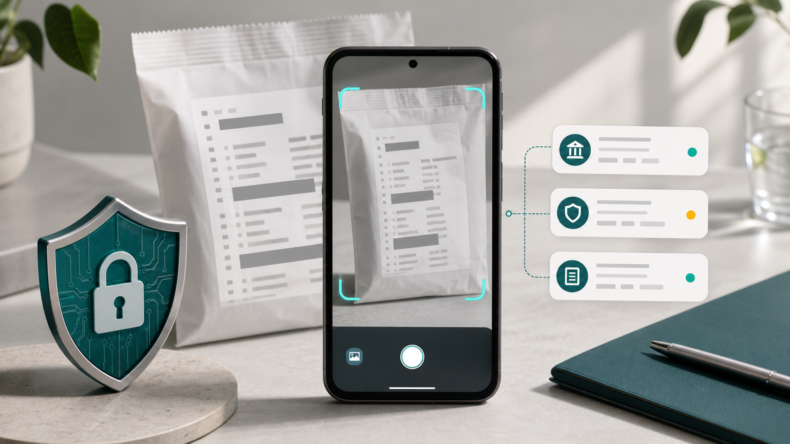

# RxScan Android

Privacy-first Android engineering project for local Korean dispensing-bag OCR and official public medicine-data lookup.

[Landing page](https://jeiel85.github.io/rxscan-android/) · [Privacy draft](https://jeiel85.github.io/rxscan-android/privacy.html) · [Engineering bootstrap](docs/ENGINEERING_BOOTSTRAP.md)



## Status

Goal 00 bootstrap is complete and Goal 01 data-builder work has started. The app currently launches to a non-medical placeholder screen. It does not contain OCR, medicine matching, signed SQLite publication, accounts, analytics, ads, or a patient-data backend.

The working product name and package ID are placeholders until final branding is selected.

## Safety boundaries

- Prescription images, OCR text, medicine selections, and saved history must not be uploaded.
- Medicine identification and parsing must be deterministic and fail closed.
- A medicine review step is mandatory before finalization.
- Official general information and photographed prescription directions must stay separate.
- User-facing medical content must be official text, a defined template, or pharmacist-reviewed fixed copy.
- Generative models must not identify medicines, parse dose, evaluate DUR, or write medical conclusions.
- Missing medicine fields must not be guessed.

## Repository layout

```text
apps/android/                 Android app and modular feature/data/engine/core modules
tools/drug-data-builder/       Typed Python package for official-data pipeline work
infra/data-distribution/       Distribution schemas and future runbooks
docs/                          GitHub Pages, public docs, and engineering notes
testdata/                      Synthetic-only development fixtures
config/                        Versioned policy and source registry YAML
schemas/                       Canonical public data and scan result schemas
prompts/                       Goal-by-goal implementation prompts
```

## Goal 00 scope

Implemented in this bootstrap:

- modular Android Gradle project with Compose placeholder home;
- min SDK 26, compile/target SDK 36;
- no Internet permission;
- dependency locking configuration;
- typed Python data-builder package with manifest contract tests;
- CI for Android, Python, type checking, and repository policy checks;
- GitHub Pages landing page and privacy draft;
- synthetic-only test data policy.

## Goal 01 data builder

Initial Goal 01 work adds:

- MFDS/data.go.kr access documentation and source operation registry;
- ServiceKey-only live fetch path through `DATA_GO_KR_SERVICE_KEY`;
- paged fetcher with timeout retries, page continuity checks, schema checks, and redacted request URLs;
- deterministic fixture build path for CI;
- tests for timeout, malformed JSON/XML, required-field drift, duplicate page, Korean UTF-8, deterministic normalization, and secret redaction.

Official API access requires data.go.kr `활용신청`. See [docs/MFDS_DATA_ACCESS.md](docs/MFDS_DATA_ACCESS.md).

Not implemented yet:

- CameraX capture;
- on-device Korean OCR;
- signed SQLite publication;
- parser, matcher, DUR evaluation, review UI, or encrypted history.

## Local verification

```powershell
.\gradlew.bat testDebugUnitTest
.\gradlew.bat :app:assembleDebug
python -m unittest discover -s tools/drug-data-builder/tests
npx --yes pyright tools/drug-data-builder
python tools/ci/check_repository_policy.py
$env:PYTHONPATH = "tools/drug-data-builder/src"
python -m rxscan_data list-sources
python -m rxscan_data build-fixture --source mfds_easy_drug --operation getDrbEasyDrugList --fixture tools/drug-data-builder/fixtures/synthetic/mfds_easy_drug_minimal.json --out tools/drug-data-builder/out/fixture-smoke
```

## Design source

Start with:

- [AGENTS.md](AGENTS.md)
- [00_MASTER_PLAN.md](00_MASTER_PLAN.md)
- [01_PRODUCT_REQUIREMENTS.md](01_PRODUCT_REQUIREMENTS.md)
- [02_SYSTEM_ARCHITECTURE.md](02_SYSTEM_ARCHITECTURE.md)
- [07_SECURITY_PRIVACY.md](07_SECURITY_PRIVACY.md)
- [09_TEST_QUALITY.md](09_TEST_QUALITY.md)
- [prompts/GOAL_00_REPOSITORY_BOOTSTRAP.md](prompts/GOAL_00_REPOSITORY_BOOTSTRAP.md)

The original bundle README is preserved at [docs/design/README.design-bundle.md](docs/design/README.design-bundle.md).

## License

License selection is pending. Do not assume redistribution rights for official source data until each source's terms are re-verified and documented.
